# 你好，我是 Yijin Zhou！👋

  <a href="./README.md">English</a> · <strong>简体中文</strong>

### 🎓 教育背景

- 中国科学技术大学软件工程学院硕士研究生

### 🚀 关于我

- 🔭 目前在中国科学技术大学攻读硕士学位
- 🌱 关注 AI 与软件开发
- 💡 喜欢探索新技术并构建有趣、实用的项目
- 🎯 致力于打造高效、可扩展的软件系统

### 🛠️ 技术栈

### 📫 联系方式

### 📊 GitHub 数据

  <picture>
    <source media="(prefers-color-scheme: dark)" srcset="./profile/stats-dark.svg">
    
  </picture>
  <picture>
    <source media="(prefers-color-scheme: dark)" srcset="./profile/top-langs-dark.svg">
    
  </picture>

### 🔀 开源 Pull Request

<!-- PR-SHOWCASE:START -->

| 仓库 | Pull Request | Stars | 状态 |
| --- | --- | ---: | :---: |
| [verl-project/verl](https://github.com/verl-project/verl) | [#6167 — [trainer] fix: convert numpy arrays to native types before dumping rollout JSONL](https://github.com/verl-project/verl/pull/6167) | 23.2k | 已合并 |
| [SWE-agent/SWE-agent](https://github.com/SWE-agent/SWE-agent) | [#1406 — Fix SimpleBatchInstance repo names containing github](https://github.com/SWE-agent/SWE-agent/pull/1406) | 20.2k | 已合并 |

<!-- PR-SHOWCASE:END -->

  <a href="https://github.com/nev8rz/nev8rz/actions/workflows/snake.yml">
    <picture>
      <source media="(prefers-color-scheme: dark)" srcset="https://raw.githubusercontent.com/nev8rz/nev8rz/output/github-contribution-grid-snake-dark.svg">
      
    </picture>
  </a>

---

  

